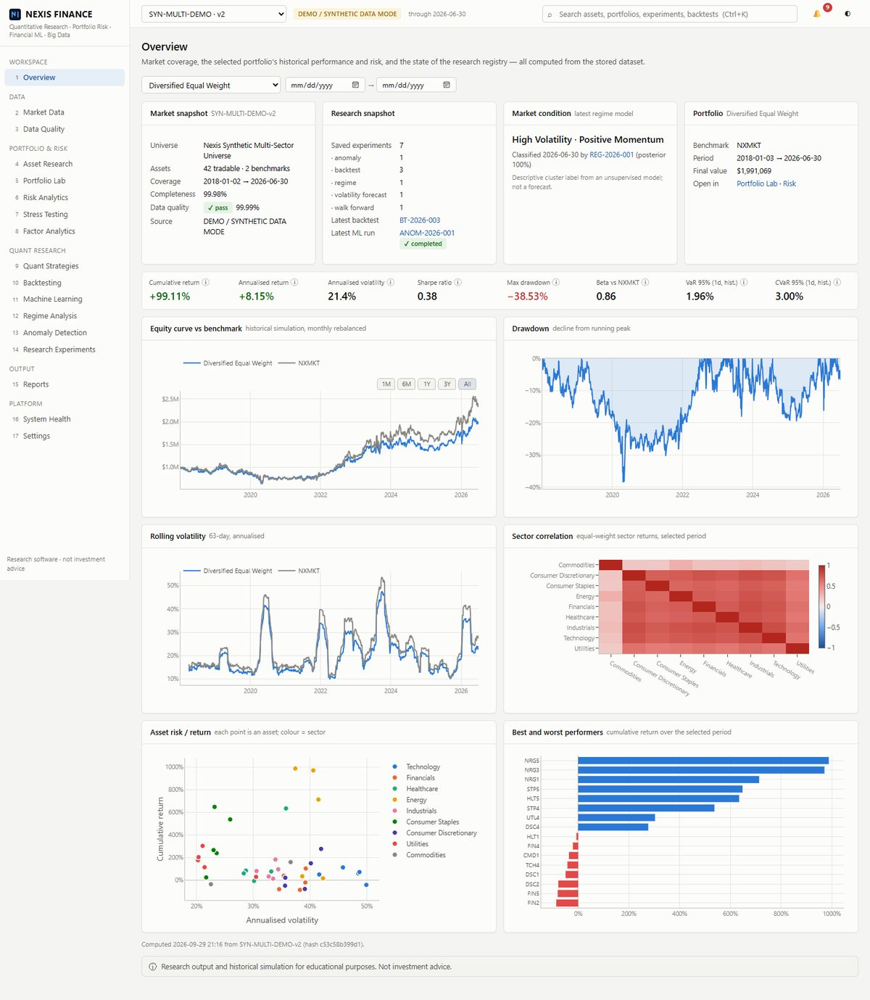
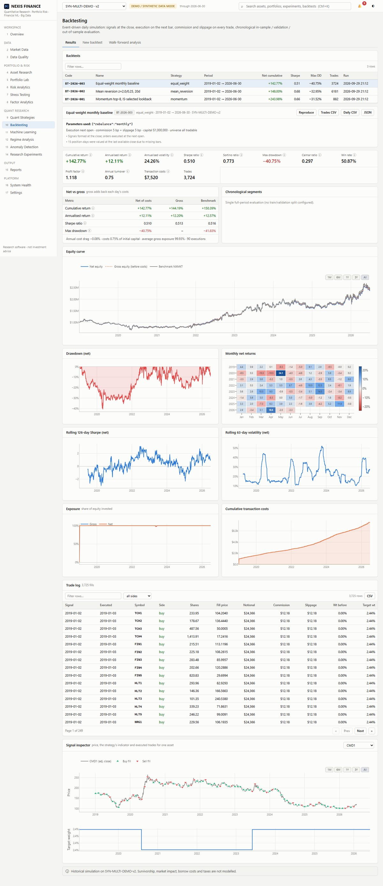
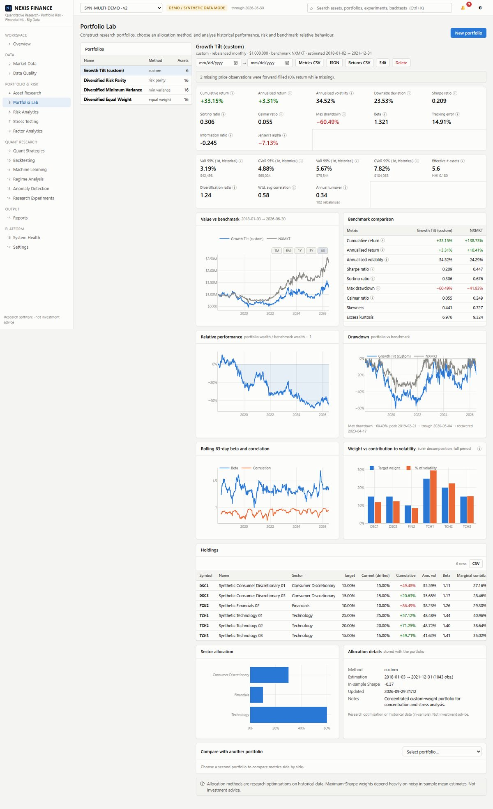
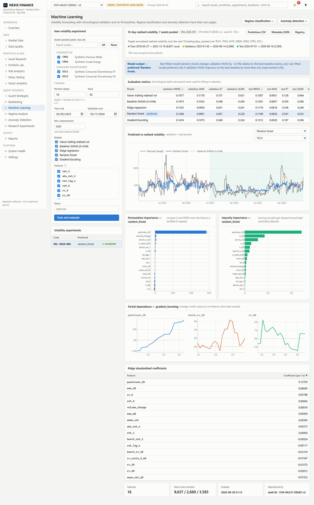
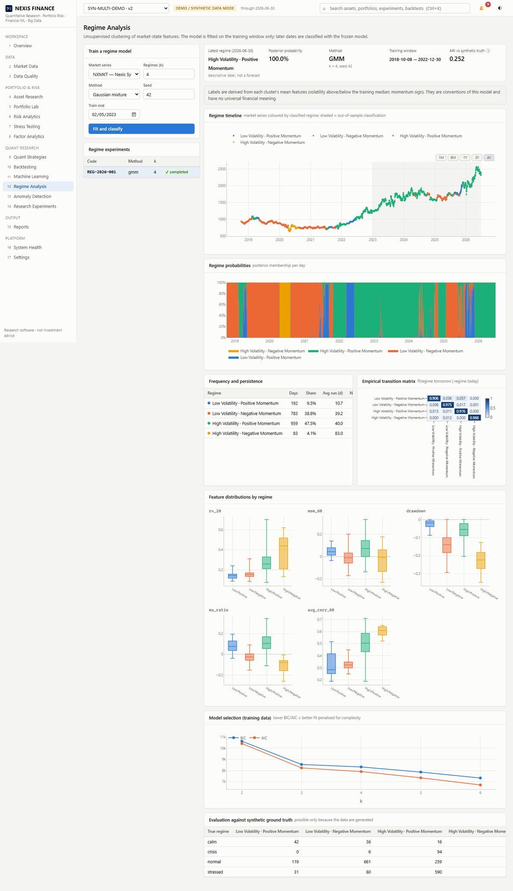
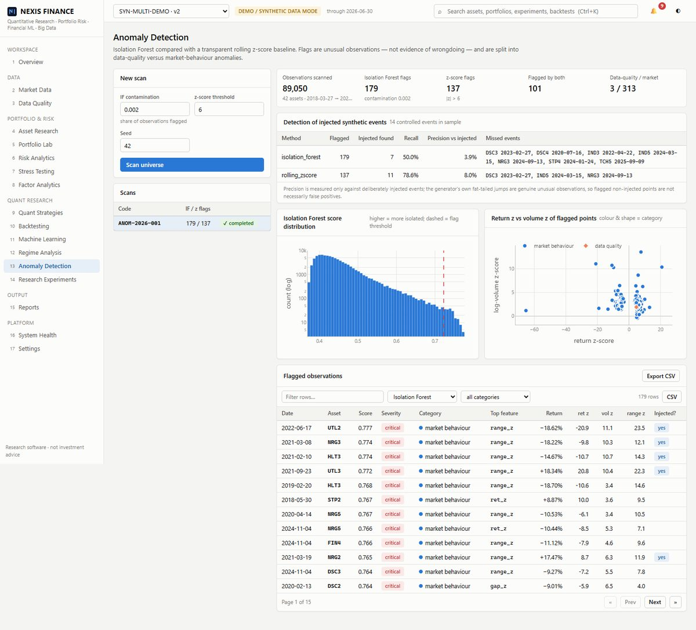
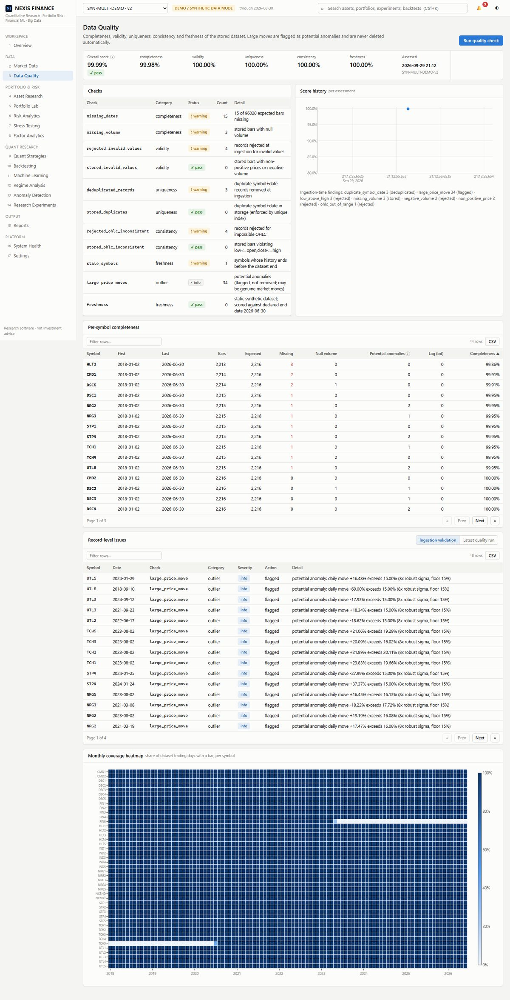
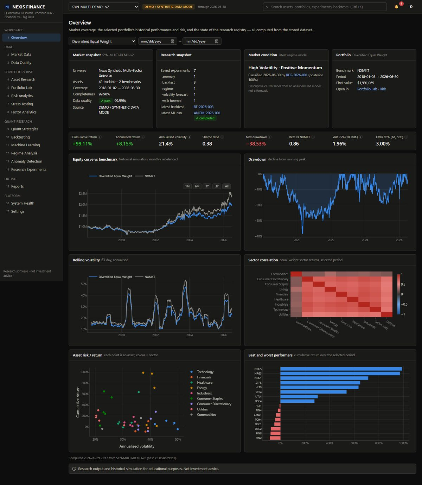

# Nexis Finance

**Quantitative Research · Portfolio Risk · Financial Machine Learning · Big Data**

> Nexis Finance — quantitative research platform for portfolio analytics, risk modelling, strategy backtesting, financial machine learning, and scalable market-data processing.

Nexis Finance is a full-stack research application: a FastAPI/SQLAlchemy backend with a tested quantitative library, and a React/TypeScript front end with interactive Plotly charts. Every number on screen comes from a calculation over stored data. There are no hardcoded results, no invented market data, and no "AI insights".

It runs fully offline in **DEMO / SYNTHETIC DATA MODE** on a seeded, documented synthetic universe. A public market-data provider and CSV upload are available for real data.

> ⚠️ Research and educational software. **Not investment advice.** Results are historical simulations or model outputs on (by default) synthetic data.

---

## Contents
1. [What it does](#what-it-does)
2. [Architecture](#architecture)
3. [Quick start](#quick-start)
4. [Quantitative methodology](#quantitative-methodology)
5. [Backtesting methodology](#backtesting-methodology)
6. [Machine-learning methodology](#machine-learning-methodology)
7. [Data](#data)
8. [Big-data pipeline](#big-data-pipeline)
9. [Testing](#testing)
10. [API](#api)
11. [Deployment](#deployment)
12. [Limitations](#limitations)
13. [Disclaimer](#disclaimer)

---

## What it does

| Area | Implemented capability |
|---|---|
| **Market data engine** | Provider abstraction (synthetic / Yahoo public chart endpoint / CSV upload). Schema normalisation, validation (dates, numerics, OHLC consistency, negative prices/volume), `symbol+date` de-duplication, incremental ingestion that requests only missing bars, versioned datasets with SHA-256 content hashes, ingestion-run metadata. |
| **Data quality** | Completeness / validity / uniqueness / consistency / freshness score. Record-level issue log. Large moves are flagged as *potential anomalies* and never deleted. Monthly coverage heatmap. |
| **Asset research** | Candlesticks with moving averages, volume, cumulative return vs benchmark, drawdown, 20/60/120/252-day rolling volatility, beta and correlation, and daily/weekly/monthly return distributions. |
| **Portfolio Lab** | Equal, custom, inverse-volatility, minimum-variance, maximum-Sharpe and risk-parity (Spinu convex formulation) weights, with Ledoit-Wolf covariance. Drift-and-rebalance simulation. Returns, risk and risk-adjusted metrics, benchmark analysis, Euler risk contributions, concentration, correlation exposure, and a two-portfolio comparison. |
| **Risk engine** | Historical, parametric-normal and Cornish-Fisher VaR. Historical/parametric CVaR at 90/95/99%, with multi-day horizons. Rolling out-of-sample VaR backtest with the Kupiec POF test. Persisted risk snapshots. |
| **Stress testing** | Beta-scaled market shocks, sector shocks with spill-over, volatility spikes, correlation increase, worst-historical-window replay, and custom per-asset shocks. All labelled hypothetical. |
| **Correlation** | Pairwise matrix exposing the observation count behind each cell, hierarchical clustering, highly-correlated pairs, and rolling average / pair correlation. |
| **Factor analytics** | Market-derived factor proxies (momentum, low-vol, liquidity-size, long-term-reversal value, drawdown-stability quality) as quintile long-short portfolios. Newey-West OLS exposures and rolling betas. |
| **Strategies & backtests** | Momentum, z-score mean reversion, MA trend filter and an equal-weight baseline. An event-driven engine executes at the next open or close, with commission and slippage, gross vs net returns, and a full trade log. In-sample → validation → out-of-sample segments, in-sample parameter search, and walk-forward analysis. |
| **Machine learning** | Volatility forecasting (naive and EWMA baselines vs Ridge / RandomForest / HistGradientBoosting) with purged chronological splits, permutation importance and partial dependence. GMM/K-means regime classification fitted on the training window only. Isolation Forest vs rolling z-score anomaly detection, split into data-quality vs market-behaviour anomalies. |
| **Research registry** | Every run is stored with a code (`VOL-2026-001`), dataset version and hash, config, seed, metrics (normalised SQL rows), notes and duration. **Reproduce** re-runs a stored config and records a metric-level comparison. Experiments can be compared side by side. |
| **Reports & exports** | PDF research reports (dataset, methodology, portfolio, risk, backtest, ML, limitations, reproducibility IDs). CSV/JSON exports for trades, daily results, metrics, predictions, anomalies, risk snapshots and the registry. |
| **Platform** | Background jobs with progress, notifications, global search, a System Health page (DB latency, freshness, record counts, request p50/p95, job failures), structured logging, structured error responses. |

The UI has 17 pages: Overview, Market Data, Data Quality, Asset Research, Portfolio Lab, Risk Analytics, Stress Testing, Factor Analytics, Quant Strategies, Backtesting, Machine Learning, Regime Analysis, Anomaly Detection, Research Experiments, Reports, System Health and Settings.

### Screenshots (synthetic demo dataset)

| Overview | Backtesting (net vs gross, segments, trade log, signal inspector) |
|---|---|
|  |  |
| **Portfolio Lab** | **Volatility forecasting vs baselines** |
|  |  |
| **Regime analysis** | **Anomaly detection vs injected events** |
|  |  |
| **Data quality** | **Dark theme** |
|  |  |

---

## Architecture

```text
 Market data sources ── SyntheticMarketDataProvider │ PublicMarketDataProvider (Yahoo chart) │ CSVMarketDataProvider
            │
            ▼
 Ingestion service ── normalise → validate (reject / dedupe / warn / flag) → incremental insert → dataset version + hash
            │
            ▼
 Data quality engine ── completeness · validity · uniqueness · consistency · freshness  → data_quality_runs / _issues
            │
            ▼
 SQL storage (SQLAlchemy + Alembic; SQLite locally, PostgreSQL in Docker) ── 21 normalised tables
            │
            ▼
 Analytics layer (pure, unit-tested functions: app/analytics, app/risk, app/strategies, app/backtesting, app/ml)
   ┌──────────────────────┬────────────────────────────┬───────────────────────────────┐
   │ Portfolio & risk     │ Quant strategies           │ Machine learning               │
   │ metrics, optimisers, │ strategy interface, event- │ point-in-time features, purged │
   │ VaR/CVaR, stress,    │ driven engine, segments,   │ splits, vol forecasting,       │
   │ factors, correlation │ grid search, walk-forward  │ regimes, anomalies             │
   └──────────────────────┴────────────────────────────┴───────────────────────────────┘
            │
            ▼
 Services (orchestration + persistence + experiment registry + job runner + notifications)
            │
            ▼
 Research API (FastAPI, OpenAPI at /docs, structured errors, request timing)
            │
            ▼
 React + TypeScript UI (Vite, TanStack Query, Plotly) ── Reports (PDF) · Exports (CSV / JSON)
```

Details, including the data model, request lifecycle and design decisions, are in [docs/ARCHITECTURE.md](docs/ARCHITECTURE.md).

```text
nexis-finance/
├── backend/
│   ├── app/
│   │   ├── api/routes/     # HTTP layer only: validation + delegation
│   │   ├── core/           # config, logging, domain errors, metric glossary
│   │   ├── db/             # engine/session, Alembic runner, reference data
│   │   ├── models/         # SQLAlchemy ORM (market, portfolio, research, ops)
│   │   ├── schemas/        # Pydantic request models
│   │   ├── data/           # providers, synthetic generator, validation, quality scoring
│   │   ├── analytics/      # metrics, rolling, portfolio simulation, optimisation, correlation, factors
│   │   ├── risk/           # VaR/CVaR + Kupiec, risk contributions, stress scenarios
│   │   ├── strategies/     # Strategy interface + implementations + registry
│   │   ├── backtesting/    # event-driven engine, segments, grid search, walk-forward
│   │   ├── ml/             # features, purged splits, volatility / regime / anomaly experiments
│   │   ├── reporting/      # PDF building blocks
│   │   └── services/       # orchestration, persistence, registry, jobs, reports, search, health
│   ├── alembic/            # migrations
│   └── tests/              # 114 tests: financial math, backtest guarantees, ML leakage, data, API
├── frontend/src/           # pages/, components/, hooks/, services/, layouts/, types/, utils/
├── scripts/                # seed_demo.py, big_data_pipeline.py, e2e_ui_check.py
├── docs/                   # ARCHITECTURE.md, METHODOLOGY.md, BIG_DATA.md, screenshots
├── data/                   # generated locally (git-ignored): SQLite DB, reports, large datasets
└── docker-compose.yml      # PostgreSQL + API + nginx-served frontend
```

---

## Quick start

Requirements: **Python 3.11+** (developed on 3.14) and **Node 20+** (developed on 24). No database server or API keys are needed.

```bash
# 1. Backend
cd backend
python -m venv .venv
.venv/Scripts/activate            # Windows  (macOS/Linux: source .venv/bin/activate)
pip install -r requirements-dev.txt

# 2. Demo data: migrations, synthetic dataset (full + incremental load), data-quality run,
#    4 portfolios, risk + stress tests, 3 backtests, walk-forward, 3 ML experiments, a PDF report.
#    Takes about 1–2 minutes. --minimal loads only data + portfolios.
python ../scripts/seed_demo.py

# 3. API  → http://127.0.0.1:8000  (OpenAPI docs: /docs)
uvicorn app.main:app --port 8000

# 4. Frontend (new terminal) → http://localhost:5173
cd frontend
npm install
npm run dev
```

Configuration is read from environment variables prefixed `NEXIS_` (see [.env.example](.env.example)). To ingest real data, set `NEXIS_PUBLIC_PROVIDER_ENABLED=true`, restart the API, and use **Market Data → Ingest → Public provider** (e.g. `SPY,QQQ,TLT,GLD`). Alternatively, upload a CSV, which needs no network access.

---

## Quantitative methodology

The conventions below are applied everywhere and are also served to the UI as tooltips (`GET /api/meta/glossary`). The full derivations are in [docs/METHODOLOGY.md](docs/METHODOLOGY.md).

* **Returns:** simple close-to-close returns on adjusted closes. Missing prices propagate as NaN and are never silently filled inside metric functions.
* **Annualisation:** 252 trading days. The annualised return is geometric (CAGR). Volatility is the sample standard deviation × √252.
* **Sharpe:** `mean(r − r_f)/std(r − r_f)·√252`, with the annual risk-free rate converted to a daily compounded rate. **Sortino** uses downside deviation below the risk-free rate. **Calmar** = annualised return / |max drawdown|.
* **Undefined statistics** (e.g. Sharpe on zero variance) return `null`/"–", never `inf`. Too few observations raise a structured `insufficient_data` error.
* **Beta, tracking error, information ratio and Jensen's alpha** are estimated on overlapping observations only. Alpha is labelled historical, not predictive.
* **VaR/CVaR** are reported as positive loss fractions:
  * Historical VaR is the empirical loss quantile.
  * Parametric VaR is Gaussian, `−(μh + zσ√h)`.
  * Cornish-Fisher adjusts the Gaussian quantile for skewness and kurtosis.
  * CVaR is the mean loss beyond VaR.
  * Minimum sample sizes are enforced (≥ 1/(1−c) and ≥ 30 observations), and small tail samples are flagged.
  * VaR is **not** a maximum loss. A rolling VaR backtest counts exceptions and applies the Kupiec proportion-of-failures test.
* **Risk contributions:** Euler decomposition `wᵢ(Σw)ᵢ/σ_p`, which sums to portfolio volatility.
* **Optimisers:** SLSQP with long-only box constraints. Infeasible bounds are rejected up front. Risk parity uses Spinu's convex formulation. Covariance uses Ledoit-Wolf shrinkage by default. Maximum-Sharpe is flagged as sensitive to noisy in-sample means.

## Backtesting methodology

* **No look-ahead by construction.** The engine hands the strategy a history window ending at the signal date's close. Later bars do not exist for it. Tests perturb all post-cutoff prices and assert that earlier signals and equity are bit-identical, for every strategy.
* **Execution timing.** Signals formed at close *t* execute at the **next open** (default) or **next close**, never at the price that generated them. A test asserts that fill prices equal the documented bar.
* **Costs.** Commission and slippage are charged on traded notional, with slippage modelled as an adverse fill price. Targets are sized on equity net of estimated costs. Gross returns add back each day's costs, so gross and net are reported side by side, along with cost drag.
* **Weights.** Targets are validated: finite, gross ≤ 100% (no leverage), no shorts for long-only strategies, and no new position in an asset that has no price at the signal close.
* **Missing data.** Untradable positions are held and valued at the last close, so a gap delays but never creates or destroys performance (tested). Delisted positions convert to cash at their final close.
* **Out-of-sample discipline.** There are chronological in-sample, validation and out-of-sample segments. A parameter grid is evaluated **on the in-sample window only** (tested by shocking post-training prices). Walk-forward re-selects parameters per fold and aggregates only the stitched fold *test* returns.
* **Survivorship.** The synthetic universe includes a late listing (TCH5) and a delisting (FIN5) so the engine's handling is exercised. For live public data, the universe is whatever symbols you ingest, which is typically survivors (documented limitation).

## Machine-learning methodology

* **Features are point-in-time.** Every value at *t* uses bars ≤ *t*, and z-score normalisation statistics end at *t−1*. Tests recompute features on truncated histories and require exact equality.
* **Volatility target:** annualised realised volatility over *t+1 … t+h*.
* **Splits** are chronological with no shuffle option anywhere. The last *h* training (and validation) dates are **purged**, because their forward targets overlap the next period.
* **Baselines:** trailing realised volatility (random-walk forecast) and RiskMetrics EWMA (λ = 0.94). A fitted model is marked *preferred* only if it improves validation RMSE by more than a configurable margin (default 2%). Otherwise the simpler baseline is preferred.
* **Metrics:** MAE, RMSE, R² and QLIKE per split. Explainability comes from test-set permutation importance, impurity importance (random forest), standardised Ridge coefficients and partial dependence.
* **Regimes:** a Gaussian mixture (or K-means) on standardised market-state features, fitted on the training window. Later dates are classified with the frozen scaler and model, and a test shows that training-window labels don't change when later data changes. Labels are derived descriptively from cluster means and are not forecasts. On synthetic data, the adjusted Rand index against the generator's true regimes is reported.
* **Anomalies:** Isolation Forest is compared with a transparent rolling z-score baseline. Flags are categorised *ex post* as data-quality (e.g. a jump that fully reverses on normal volume, or a known record issue) or market-behaviour. Recall is measured against the generator's injected events. In the demo, the simple baseline has the higher recall, and the app reports that plainly.
* **Reproducibility:** each run stores its config, seed and dataset hash. Models use fixed seeds and single-threaded estimators so floating-point results are bit-for-bit reproducible. **Reproduce** reports the maximum absolute metric difference.

## Data

* **Schema:** `symbol, date, open, high, low, close, adj_close, volume`, stored once per `(asset, date)` under a unique composite index.
* **Synthetic mode (default).** [`app/data/synthetic.py`](backend/app/data/synthetic.py) generates 40 equities across 8 sectors, 2 commodities, a synthetic equal-weight market index and a bond index, as business-day bars from 2018-01-02 to 2026-06-30 with seed 42. The model includes:
  * a 4-state Markov regime process plus scheduled crisis and stress episodes;
  * a Student-t market factor, sector factors, GARCH(1,1) idiosyncratic noise, a persistent AR(1) drift (momentum), an Ornstein-Uhlenbeck component (short-horizon mean reversion) and jumps;
  * a late listing and a delisting;
  * 12 injected market events and 24 injected data defects (swapped high/low, negative prices and volume, missing bars and volumes, near-duplicate records, and "bad ticks").

  Everything injected is recorded in a ground-truth manifest (`GET /api/datasets/{id}/manifest`, also written to `data/demo/manifest.json`). The UI shows a **DEMO / SYNTHETIC DATA MODE** badge whenever a synthetic dataset is active, and reports carry a banner.
* **Public mode.** The Yahoo Finance chart endpoint is unofficial, has no SLA, and is disabled by default. Network failures and bad responses become structured `provider_unavailable` errors and failed ingestion runs with notifications.
* **CSV upload.** Common column aliases are accepted. Uploads are size-limited, and parsing errors are reported as validation errors.

## Big-data pipeline

[`scripts/big_data_pipeline.py`](scripts/big_data_pipeline.py) generates 10k–1M+ records locally and runs batch ETL over partitioned Parquet: streamed validation, per-partition feature transforms, pandas and SQL aggregation, and an incremental append. It records runtime and peak RSS for each stage. A recorded run on the development machine (16 logical CPUs, 15.7 GB RAM):

| stage (1,000,992 rows) | seconds | peak RSS |
|---|---:|---:|
| generate (partitioned Parquet) | 1.01 | 123 MB |
| ingest + validate (streamed by partition) | 0.80 | 196 MB |
| rolling features (per symbol partition) | 6.92 | 313 MB |
| monthly + cross-sectional aggregation (pandas, vectorised) | 0.53 | 425 MB |
| same monthly aggregation in SQL (SQLite: load 14.9 s + query 4.2 s) | 19.05 | 402 MB |
| incremental append (one partition) | 0.34 | 387 MB |

**PySpark is deliberately not included.** At this scale a single process handles the work in seconds, and no JVM is available in the development environment. [docs/BIG_DATA.md](docs/BIG_DATA.md) explains when Spark would be warranted and how the pipeline's stages map onto it.

## Testing

```bash
cd backend
pytest                  # 114 tests, about 1 minute
ruff check app tests ../scripts && ruff format --check app tests ../scripts
cd ../frontend && npm run typecheck && npm run build
# optional browser workflow check (API + Vite dev server running; needs `pip install playwright` and Edge/Chromium)
python ../scripts/e2e_ui_check.py
```

| Suite | What it proves |
|---|---|
| `test_metrics.py` | Returns, CAGR, volatility, Sharpe/Sortino, drawdown (incl. first-day loss), Calmar, beta/TE, win rate/profit factor against hand-calculated values; zero variance, constant prices, empty/short input, missing dates. |
| `test_risk_and_portfolio.py` | VaR/CVaR hand values, the normal CVaR/VaR ratio, monotonicity, minimum samples, Kupiec, the rolling VaR backtest using only past data, Euler contributions summing to σ, drift vs rebalance, turnover, analytic min-variance and risk-parity weights, bounds, correlation pair counts, stress scenarios. |
| `test_backtest.py` | Strategies never see future bars; perturbing future prices leaves past signals identical; exact cost accounting; a known tiny-dataset result; next-open vs next-close fills; monthly rebalancing; invalid weights rejected; missing bars neither create nor destroy performance; delisting; segments; grid search ignoring post-training data; non-overlapping walk-forward folds; determinism. |
| `test_ml.py` | Point-in-time features; the forward-target definition; purged splits with exact purge counts; shuffled data refused; metric values; prediction shapes; seed reproducibility; train metrics unchanged when post-validation prices change; regime labels frozen in the training window; anomaly recall and bad-tick classification; serialisation. |
| `test_data.py` | Generator reproducibility; every injected defect caught; each validation rule; large moves flagged not deleted; quality score components; CSV aliases; public provider parsing and network failures via a mocked transport. |
| `test_api.py` | The full workflow through HTTP, including structured 404/409/422 errors, reproduction matching bit-for-bit, PDF download and exports. |

## API

Interactive OpenAPI documentation is at **http://127.0.0.1:8000/docs** (ReDoc at `/redoc`). Main resources:

```text
GET  /api/health                     GET  /api/system/health           GET /api/overview
GET  /api/datasets[/{id}[/manifest]] GET  /api/assets[/{symbol}]       GET /api/market-data
POST /api/market-data/ingest         POST /api/market-data/upload      GET /api/ingestion-runs
GET  /api/data-quality               POST /api/data-quality/run        GET /api/data-quality/issues
GET  /api/research/assets/{symbol}   GET  /api/research/correlation    GET /api/research/factors
GET|POST /api/portfolios             GET|PUT|DELETE /api/portfolios/{id}   GET /api/portfolios/{id}/analytics
POST /api/portfolios/preview-allocation                               GET /api/portfolios/compare
POST /api/risk/analyze               GET  /api/risk/history/{id}       POST /api/stress-tests
GET  /api/strategies                 POST /api/backtests (202 job)     POST /api/backtests/walk-forward
GET  /api/backtests/{id}[/trades|/diagnostics/{symbol}]
POST /api/ml/experiments/{volatility|regime|anomaly} (202 job)        GET /api/ml/experiments/{id}/{predictions|anomalies}
GET  /api/experiments[/compare|/{id}]  POST /api/experiments/{id}/reproduce   PATCH|DELETE /api/experiments/{id}
POST /api/reports (202 job)          GET  /api/reports/{id}/download   GET /api/exports/...
GET  /api/jobs/{id}                  GET  /api/search?q=               GET /api/notifications
```

Errors always have the shape `{"error": {"code", "message", "details"}}`, with appropriate status codes (404, 409, 422, 502, 503, 500). Stack traces are logged server-side only.

## Deployment

```bash
docker compose up --build                                  # PostgreSQL 16 + API + nginx frontend
docker compose exec api python /app/scripts/seed_demo.py   # load demo data
# UI http://localhost:8080 · API docs http://localhost:8000/docs
```

The same Alembic migrations run against PostgreSQL. Their DDL was rendered and checked with `alembic upgrade head --sql` against the PostgreSQL dialect. The Compose stack itself was **not executed** in the development environment, which had no Docker, so treat it as a starting point. For production you would also want real secrets management, authentication (none is implemented; see below), a proper job queue (Celery/RQ) instead of the in-process thread pool, and HTTPS termination.

## Limitations

* The default data is synthetic. Its statistical properties are designed, not observed. Real-market conclusions require real data.
* Daily bars only. There is no intraday path, market impact, borrow or financing cost, or tax modelling. Costs are linear in traded notional.
* The live public provider is an unofficial endpoint. Ingested live universes suffer survivorship bias.
* Factor analytics use price- and volume-derived **proxies**. No accounting fundamentals are available, and none are fabricated.
* Regime labels and anomaly flags are unsupervised model outputs with no guaranteed economic meaning.
* The job runner is an in-process thread pool: jobs survive page reloads but not API restarts.
* No authentication or multi-user separation. It's a single-user research tool; a fake login screen would add nothing.
* No LLM "research assistant" is included, by design. All analytical output comes from deterministic backend calculations.

## Disclaimer

Nexis Finance is software for research and educational purposes. Nothing it produces is investment advice, an offer, or a solicitation to buy or sell any security. Simulated and historical results do not predict future results.

**Suggested repository topics:** `python` `quantitative-finance` `machine-learning` `financial-data` `portfolio-analytics` `risk-management` `backtesting` `pandas` `scikit-learn` `fastapi` `react` `typescript` `sql` `data-engineering`
